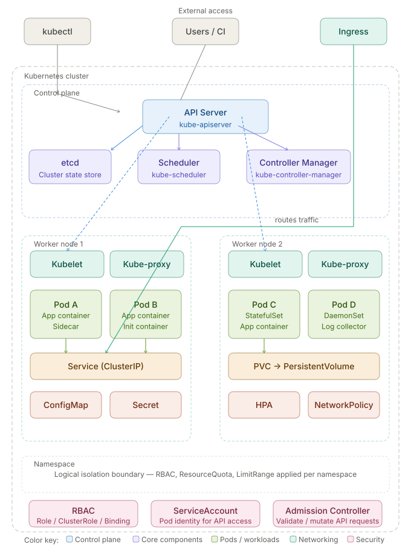

# ☸️ Kubernetes Glossary & Interview Preparation Guide

A comprehensive reference of Kubernetes terms, concepts, and definitions — organized by category. Ideal for interview prep, onboarding, and day-to-day reference.

---

## 🗺️ Architecture Diagram



> Full cluster view — control plane, worker nodes, networking, storage, config, and security layers.

---

## 📑 Table of Contents

- [Core Architecture](#-core-architecture)
- [Workloads](#-workloads)
- [Networking](#-networking)
- [Storage](#-storage)
- [Configuration & Scaling](#-configuration--scaling)
- [Security & RBAC](#-security--rbac)
- [Ops & Tooling](#-ops--tooling)
- [Observability & Interfaces](#-observability--interfaces)
- [Pod Troubleshooting Guide](#-pod-troubleshooting-guide)
- [Interview Tips](#-interview-tips)
- [kubectl apply Lifecycle](#-kubectl-apply-lifecycle)
- [Deployment Strategies](#-deployment-strategies)
- [Resource Requests vs Limits](#-resource-requests-vs-limits)
- [Probe Types Deep Dive](#-probe-types-deep-dive)
- [Advanced kubectl Debugging](#-advanced-kubectl-debugging)
- [Networking Deep Dive](#-networking-deep-dive)
- [Multi-Container Pod Patterns](#-multi-container-pod-patterns)
- [etcd Backup & Restore](#-etcd-backup--restore)
- [Real-World Scenario Questions](#-real-world-scenario-questions)
- [CKA / CKAD Exam Tips](#-cka--ckad-exam-tips)

---

## 🏗️ Core Architecture

| Term | Abbreviation | Definition |
|------|-------------|------------|
| **Cluster** | — | A set of nodes (machines) that run containerized applications managed by Kubernetes. |
| **Node** | — | A physical or virtual machine in the cluster that runs Pods. Can be a control plane or worker node. |
| **Control Plane** | — | The set of components that manage the cluster — API Server, etcd, Scheduler, and Controller Manager. |
| **Worker Node** | — | A node that runs application workloads (Pods). Managed by the control plane. |
| **API Server** | `kube-apiserver` | The front-end of the control plane. Exposes the Kubernetes REST API and is the entry point for all commands. |
| **etcd** | — | A consistent, highly-available key-value store used to store all cluster configuration and state data. |
| **Scheduler** | `kube-scheduler` | Watches for newly created Pods and assigns them to a suitable node based on resource requirements and constraints. |
| **Controller Manager** | `kube-controller-manager` | Runs controller loops that watch the cluster state and make changes to bring actual state to desired state. |
| **Kubelet** | — | An agent on each worker node that ensures containers in a Pod are running and healthy. |
| **Kube-proxy** | — | A network proxy on each node that maintains network rules for communication to Pods from inside or outside the cluster. |
| **Namespace** | `ns` | A virtual cluster within a Kubernetes cluster used to isolate resources and workloads. |
| **kubectl** | — | The command-line tool used to interact with and manage Kubernetes clusters. |

---

## 📦 Workloads

| Term | Abbreviation | Definition |
|------|-------------|------------|
| **Pod** | `po` | The smallest deployable unit in Kubernetes. A Pod wraps one or more containers that share network and storage. |
| **Deployment** | `deploy` | Manages a ReplicaSet to ensure a specified number of identical Pods are running. Supports rolling updates and rollbacks. |
| **ReplicaSet** | `rs` | Ensures a specified number of Pod replicas are running at any given time. Usually managed by a Deployment. |
| **StatefulSet** | `sts` | Manages stateful applications. Provides stable network identities and persistent storage for each Pod. |
| **DaemonSet** | `ds` | Ensures a copy of a Pod runs on all (or selected) nodes. Used for cluster-wide services like log collectors. |
| **Job** | — | Creates one or more Pods and ensures they run to completion successfully. Ideal for batch tasks. |
| **CronJob** | `cj` | Schedules Jobs to run at specific times or intervals, similar to a Unix cron. |
| **ReplicationController** | `rc` | Legacy resource that ensures a specified number of Pod replicas are running. Superseded by ReplicaSet. |
| **Init Container** | — | A special container that runs before app containers in a Pod, used for setup tasks. |
| **Sidecar Container** | — | A helper container running alongside the main app container in the same Pod, sharing its lifecycle. |

---

## 🌐 Networking

| Term | Abbreviation | Definition |
|------|-------------|------------|
| **Service** | `svc` | An abstraction that exposes a set of Pods as a stable network endpoint with a consistent IP and DNS name. |
| **ClusterIP** | — | The default Service type. Exposes the Service on a cluster-internal IP — only reachable within the cluster. |
| **NodePort** | — | Exposes a Service on a static port on each node's IP, making it accessible from outside the cluster. |
| **LoadBalancer** | `lb` | Exposes a Service externally using a cloud provider's load balancer. |
| **ExternalName** | — | A Service type that maps a Service to a DNS name (e.g., an external database) instead of a selector. |
| **Ingress** | `ing` | Manages external HTTP/HTTPS access to Services, providing routing rules, TLS termination, and virtual hosting. |
| **Ingress Controller** | — | A controller that implements Ingress rules (e.g., NGINX, Traefik). Required for Ingress resources to work. |
| **NetworkPolicy** | `netpol` | Specifies how groups of Pods are allowed to communicate with each other and with external endpoints. |
| **Endpoint** | `ep` | Lists the IP addresses and ports of Pods backing a Service. Auto-managed by Kubernetes. |
| **DNS (CoreDNS)** | — | Kubernetes includes a built-in DNS service (CoreDNS) that assigns DNS names to Services and Pods. |

---

## 💾 Storage

| Term | Abbreviation | Definition |
|------|-------------|------------|
| **Volume** | — | A directory accessible to containers in a Pod. Survives container restarts but not Pod deletion (unless persistent). |
| **PersistentVolume** | `PV` | A piece of storage in the cluster provisioned by an admin or dynamically. Independent of any Pod lifecycle. |
| **PersistentVolumeClaim** | `PVC` | A request for storage by a user. Binds to a matching PersistentVolume. |
| **StorageClass** | `sc` | Describes different classes of storage (e.g., SSD vs HDD). Enables dynamic provisioning of PersistentVolumes. |
| **emptyDir** | — | A temporary directory created when a Pod is assigned to a node. Deleted when the Pod is removed. |
| **hostPath** | — | Mounts a file or directory from the host node's filesystem into a Pod. |
| **ConfigMap Volume** | — | Mounts ConfigMap data as files into a Pod's filesystem. |

---

## ⚙️ Configuration & Scaling

| Term | Abbreviation | Definition |
|------|-------------|------------|
| **ConfigMap** | `cm` | Stores non-confidential configuration data as key-value pairs, injected into Pods as env vars or files. |
| **Secret** | — | Stores sensitive data (passwords, tokens) in base64 encoding. Injected into Pods similar to ConfigMaps. |
| **ResourceQuota** | `quota` | Limits total resource consumption (CPU, memory, object count) per namespace. |
| **LimitRange** | — | Enforces default and maximum resource limits for Pods and containers within a namespace. |
| **HorizontalPodAutoscaler** | `HPA` | Automatically scales the number of Pod replicas based on observed CPU/memory or custom metrics. |
| **VerticalPodAutoscaler** | `VPA` | Automatically adjusts CPU and memory requests for containers based on historical usage. |
| **PodDisruptionBudget** | `PDB` | Limits the number of Pods that can be down simultaneously during voluntary disruptions. |
| **PriorityClass** | `pc` | Assigns a priority to Pods to control scheduling order and eviction during resource pressure. |

---

## 🔐 Security & RBAC

| Term | Abbreviation | Definition |
|------|-------------|------------|
| **ServiceAccount** | `sa` | Provides an identity for processes running in a Pod to authenticate with the Kubernetes API. |
| **RBAC** | Role-Based Access Control | An authorization mechanism that regulates access to Kubernetes resources based on roles assigned to users. |
| **Role** | — | A set of permissions (rules) within a namespace. Used in RBAC. |
| **ClusterRole** | — | A set of permissions that apply cluster-wide or can be used in any namespace. |
| **RoleBinding** | `rb` | Binds a Role to a user, group, or ServiceAccount within a namespace. |
| **ClusterRoleBinding** | `crb` | Binds a ClusterRole to a user, group, or ServiceAccount cluster-wide. |
| **PodSecurityContext** | — | Defines security settings (user ID, file permissions) applied at the Pod level. |
| **SecurityContext** | — | Defines security settings for individual containers, such as running as non-root or read-only filesystem. |
| **Admission Controller** | — | A plugin that intercepts API requests after authentication to validate or mutate them before persisting. |

---

## 🛠️ Ops & Tooling

| Term | Abbreviation | Definition |
|------|-------------|------------|
| **Helm** | — | A package manager for Kubernetes. Charts bundle Kubernetes resources into reusable, configurable packages. |
| **Helm Chart** | — | A collection of Kubernetes manifest templates packaged together for deployment via Helm. |
| **Kustomize** | — | A tool to customize Kubernetes manifests without templating, using overlays and patches. |
| **Operator** | — | A pattern that extends Kubernetes to manage complex stateful apps using custom controllers and CRDs. |
| **CustomResourceDefinition** | `CRD` | Extends the Kubernetes API by defining new resource types specific to an application. |
| **Custom Resource** | `CR` | An instance of a CRD — a user-defined object managed by the Kubernetes API. |
| **Taint** | — | Applied to a node to repel Pods that don't explicitly tolerate it. Used for node isolation. |
| **Toleration** | — | Applied to a Pod to allow it to be scheduled on nodes with matching taints. |
| **Affinity** | — | Rules that attract Pods to specific nodes or other Pods based on labels. |
| **Anti-affinity** | — | Rules that repel Pods from being placed on the same nodes as certain other Pods. |
| **Label** | — | Key-value pairs attached to objects for identification and selection. |
| **Annotation** | — | Key-value pairs attached to objects to store non-identifying metadata (e.g., version info, tool config). |
| **Selector** | — | A query that filters Kubernetes objects by their labels. |

---

## 📊 Observability & Interfaces

| Term | Abbreviation | Definition |
|------|-------------|------------|
| **Liveness Probe** | — | Checks if a container is still running. Restarts it if the probe fails. |
| **Readiness Probe** | — | Checks if a container is ready to receive traffic. Removes it from Service endpoints if it fails. |
| **Startup Probe** | — | Checks if an app within a container has started. Disables liveness/readiness probes until it succeeds. |
| **Metrics Server** | — | A cluster-wide aggregator of resource usage data (CPU, memory) used by HPA and `kubectl top`. |
| **Container Runtime** | — | Software responsible for running containers (e.g., containerd, CRI-O). Implements the CRI interface. |
| **CRI** | Container Runtime Interface | A plugin interface that enables the kubelet to use different container runtimes. |
| **CNI** | Container Network Interface | A standard for configuring network interfaces in Linux containers. Plugins like Flannel and Calico implement it. |
| **CSI** | Container Storage Interface | A standard for exposing storage systems to containerized workloads on Kubernetes. |

---

## 🔧 Pod Troubleshooting Guide

A practical reference for diagnosing and fixing the most common Pod issues in Kubernetes.

---

### Issue 1 — Pod stuck in `Pending` state

**Symptoms**
```
NAME        READY   STATUS    RESTARTS   AGE
my-pod      0/1     Pending   0          5m
```

**Common causes**
- Insufficient CPU or memory on all nodes
- No node matches the Pod's `nodeSelector` or `affinity` rules
- Node has a taint that the Pod does not tolerate
- PersistentVolumeClaim is unbound (no matching PV)

**Diagnosis**
```bash
kubectl describe pod <pod-name>
# Look for "Events" section at the bottom — it shows the exact reason
# Common messages:
#   "0/3 nodes are available: 3 Insufficient memory"
#   "0/3 nodes are available: 3 node(s) had taint..."
#   "persistentvolumeclaim <name> not found"
```

**Fix**
```bash
# Check node resource availability
kubectl describe nodes | grep -A5 "Allocated resources"

# Check if PVC is bound
kubectl get pvc -n <namespace>

# Check taints on nodes
kubectl describe node <node-name> | grep Taints
```

---

### Issue 2 — Pod in `CrashLoopBackOff`

**Symptoms**
```
NAME        READY   STATUS             RESTARTS   AGE
my-pod      0/1     CrashLoopBackOff   8          12m
```

**Common causes**
- Application error or uncaught exception at startup
- Missing environment variable or config
- Incorrect command/entrypoint in the container spec
- Liveness probe failing immediately

**Diagnosis**
```bash
# Check logs from the current (crashing) container
kubectl logs <pod-name>

# Check logs from the previous crashed container
kubectl logs <pod-name> --previous

# Describe for probe and restart details
kubectl describe pod <pod-name>
```

**Fix**
```bash
# Override the entrypoint to debug interactively
kubectl run debug --image=<your-image> -it --restart=Never -- /bin/sh

# Check env vars are correctly set
kubectl exec -it <pod-name> -- env | grep MY_VAR

# If liveness probe is too aggressive, increase initialDelaySeconds:
# livenessProbe:
#   initialDelaySeconds: 30   # give the app time to start
```

---

### Issue 3 — Pod stuck in `ImagePullBackOff` or `ErrImagePull`

**Symptoms**
```
NAME        READY   STATUS             RESTARTS   AGE
my-pod      0/1     ImagePullBackOff   0          3m
```

**Common causes**
- Image name or tag is incorrect (typo, wrong registry)
- Image is private and no pull secret is configured
- Registry is unreachable from the cluster network
- Image tag does not exist (e.g., using `latest` that was never pushed)

**Diagnosis**
```bash
kubectl describe pod <pod-name>
# Events will show:
#   "Failed to pull image: rpc error: ... not found"
#   "Failed to pull image: ... unauthorized: authentication required"
```

**Fix**
```bash
# Verify the image exists and tag is correct
docker pull <image>:<tag>

# Create an image pull secret for private registries
kubectl create secret docker-registry regcred \
  --docker-server=<registry-url> \
  --docker-username=<username> \
  --docker-password=<password> \
  --docker-email=<email>

# Reference the secret in the Pod spec:
# spec:
#   imagePullSecrets:
#     - name: regcred
```

---

### Issue 4 — Pod in `OOMKilled` (Out of Memory)

**Symptoms**
```
NAME        READY   STATUS      RESTARTS   AGE
my-pod      0/1     OOMKilled   3          8m
```
```bash
# kubectl describe output shows:
# Last State: Terminated  Reason: OOMKilled
```

**Common causes**
- Container memory limit is set too low
- Application has a memory leak
- Sudden traffic spike causing high memory usage

**Diagnosis**
```bash
kubectl describe pod <pod-name>
# Look for: "Last State: Terminated  Reason: OOMKilled  Exit Code: 137"

# Check current memory usage
kubectl top pod <pod-name>
kubectl top pod <pod-name> --containers
```

**Fix**
```yaml
# Increase memory limit in your manifest:
resources:
  requests:
    memory: "256Mi"
  limits:
    memory: "512Mi"   # increase this value

# Apply the change
kubectl apply -f deployment.yaml
```

---

### Issue 5 — Pod in `Error` state (Exit Code issues)

**Symptoms**
```
NAME        READY   STATUS   RESTARTS   AGE
my-pod      0/1     Error    0          1m
```

**Common exit codes**

| Exit Code | Meaning |
|-----------|---------|
| `0` | Success — container completed normally |
| `1` | General application error |
| `2` | Misuse of shell command |
| `126` | Command found but not executable |
| `127` | Command not found |
| `128` | Invalid exit argument |
| `137` | Container killed (SIGKILL) — often OOMKill |
| `143` | Graceful termination (SIGTERM) |

**Diagnosis**
```bash
kubectl logs <pod-name> --previous
kubectl describe pod <pod-name>
# Check "Exit Code" under "Last State"
```

**Fix**
```bash
# For exit code 127 (command not found) — check entrypoint:
kubectl run test --image=<your-image> -it --restart=Never -- which myapp

# For exit code 1 — check application logs for the actual error
kubectl logs <pod-name> --previous | tail -50
```

---

### Issue 6 — Pod not receiving traffic (`Endpoints` empty)

**Symptoms**
- Service exists but requests time out or return connection refused
- Application is running but unreachable

**Common causes**
- Service `selector` labels do not match Pod labels
- Pod's `containerPort` does not match Service `targetPort`
- Readiness probe is failing — Pod is Running but not Ready

**Diagnosis**
```bash
# Check if endpoints are populated
kubectl get endpoints <service-name>
# If ADDRESS column is empty — selector mismatch or pod not Ready

# Compare service selector vs pod labels
kubectl get svc <service-name> -o yaml | grep selector -A5
kubectl get pod <pod-name> --show-labels

# Check readiness
kubectl describe pod <pod-name> | grep -A10 "Readiness"
```

**Fix**
```yaml
# Ensure labels match exactly. Example:
# Service selector:
selector:
  app: my-app
  tier: backend

# Pod labels must include BOTH:
metadata:
  labels:
    app: my-app
    tier: backend
```

---

### Issue 7 — Pod evicted due to node pressure

**Symptoms**
```
NAME        READY   STATUS    RESTARTS   AGE
my-pod      0/1     Evicted   0          30m
```

**Common causes**
- Node is under disk pressure (`DiskPressure`)
- Node is under memory pressure (`MemoryPressure`)
- Node PID pressure (`PIDPressure`)
- Low-priority Pods are evicted to make room for high-priority ones

**Diagnosis**
```bash
kubectl describe pod <pod-name>
# Message: "The node was low on resource: memory. Threshold quantity: 100Mi"

# Check node conditions
kubectl describe node <node-name> | grep -A10 "Conditions"

# Check node disk usage
kubectl exec -it <any-pod> -- df -h
```

**Fix**
```bash
# Delete the evicted pod (it won't self-heal)
kubectl delete pod <pod-name>

# Free up disk space on the node (if disk pressure)
# Remove unused images:
docker image prune -a

# Set proper resource requests to trigger proper scheduling:
resources:
  requests:
    memory: "128Mi"
    cpu: "100m"

# Assign a PriorityClass to protect critical pods from eviction
```

---

### Issue 8 — `Init:Error` or `Init:CrashLoopBackOff`

**Symptoms**
```
NAME        READY   STATUS              RESTARTS   AGE
my-pod      0/1     Init:CrashLoopBackOff  3       5m
```

**Common causes**
- Init container fails to complete (non-zero exit code)
- Init container is waiting for a dependency (DB, config service) that is unavailable
- Wrong command or missing binary in the init container image

**Diagnosis**
```bash
# List init containers
kubectl describe pod <pod-name> | grep -A5 "Init Containers"

# Get logs from the failing init container
kubectl logs <pod-name> -c <init-container-name>

# Get logs from previous failed run
kubectl logs <pod-name> -c <init-container-name> --previous
```

**Fix**
```yaml
# Common pattern: wait for a service to be ready before starting
initContainers:
  - name: wait-for-db
    image: busybox
    command: ['sh', '-c',
      'until nc -z db-service 5432; do echo waiting for db; sleep 2; done']
```

---

### Issue 9 — Pod restarts repeatedly but shows `Running`

**Symptoms**
```
NAME        READY   STATUS    RESTARTS   AGE
my-pod      1/1     Running   47         2h
```

**Common causes**
- Liveness probe is too sensitive (low timeout, aggressive thresholds)
- Application deadlocks after some time and stops responding
- Memory leak causing periodic OOM kills
- External dependency flapping

**Diagnosis**
```bash
# Check restart count and last termination reason
kubectl describe pod <pod-name>
# Look for: "Last State: Terminated  Reason: Error / OOMKilled"

# Watch restarts in real-time
kubectl get pod <pod-name> -w

# Check logs around the time of restart
kubectl logs <pod-name> --previous --timestamps | tail -100
```

**Fix**
```yaml
# Tune liveness probe to be less aggressive:
livenessProbe:
  httpGet:
    path: /healthz
    port: 8080
  initialDelaySeconds: 60   # wait before first check
  periodSeconds: 30          # check every 30s (not every 5s)
  failureThreshold: 3        # allow 3 failures before restart
  timeoutSeconds: 5          # give app 5s to respond
```

---

### Issue 10 — Pod stuck in `Terminating` state

**Symptoms**
```
NAME        READY   STATUS        RESTARTS   AGE
my-pod      1/1     Terminating   0          2h
```

**Common causes**
- Application is not handling `SIGTERM` and not shutting down within `terminationGracePeriodSeconds`
- A finalizer is blocking deletion
- Node is unreachable (kubelet cannot confirm termination)

**Diagnosis**
```bash
kubectl describe pod <pod-name>
# Check for finalizers
kubectl get pod <pod-name> -o yaml | grep finalizers -A5

# Check node status
kubectl get node <node-name>
```

**Fix**
```bash
# Force delete when node is unreachable or finalizer is stuck
kubectl delete pod <pod-name> --force --grace-period=0

# Remove a stuck finalizer manually
kubectl patch pod <pod-name> -p '{"metadata":{"finalizers":[]}}' --type=merge

# Fix app code: handle SIGTERM gracefully
# In your app, listen for SIGTERM and shut down cleanly within
# terminationGracePeriodSeconds (default: 30s)
```

---

### 🩺 General Troubleshooting Workflow

```bash
# Step 1 — Check pod status
kubectl get pods -n <namespace>

# Step 2 — Describe the pod for events and state
kubectl describe pod <pod-name> -n <namespace>

# Step 3 — Check current logs
kubectl logs <pod-name> -n <namespace>

# Step 4 — Check previous container logs (if restarted)
kubectl logs <pod-name> --previous -n <namespace>

# Step 5 — Exec into the pod for interactive debugging
kubectl exec -it <pod-name> -n <namespace> -- /bin/sh

# Step 6 — Check cluster events sorted by time
kubectl get events -n <namespace> --sort-by='.lastTimestamp'

# Step 7 — Check node health
kubectl get nodes
kubectl describe node <node-name>

# Step 8 — Check resource usage
kubectl top pods -n <namespace>
kubectl top nodes
```

---

### 📋 Pod Status Quick Reference

| Status | Meaning | Where to look |
|--------|---------|---------------|
| `Pending` | Not scheduled yet | Node resources, taints, PVC |
| `Running` | At least one container is running | Logs, probes |
| `CrashLoopBackOff` | Container crashes and restarts repeatedly | `logs --previous`, entrypoint |
| `ImagePullBackOff` | Cannot pull the container image | Image name, pull secret |
| `OOMKilled` | Killed due to exceeding memory limit | Memory limits, leaks |
| `Error` | Container exited with non-zero code | `logs --previous`, exit code |
| `Evicted` | Removed by kubelet due to node pressure | Node disk/memory, events |
| `Terminating` | Deletion in progress | Finalizers, node status |
| `Init:Error` | Init container failed | Init container logs |
| `Completed` | All containers finished successfully | Normal for Jobs |
| `Unknown` | Cannot communicate with the node | Node status, kubelet |

---

## 🎯 Interview Tips

### Common interview question areas

**Architecture**
- Explain the difference between the control plane and worker nodes.
- What happens when you run `kubectl apply -f deployment.yaml`?
- How does the Kubernetes Scheduler decide where to place a Pod?

**Workloads**
- When would you use a StatefulSet over a Deployment?
- What is the difference between a Job and a CronJob?
- What are Init Containers used for?

**Networking**
- Explain the difference between ClusterIP, NodePort, and LoadBalancer.
- What is an Ingress and why do you need an Ingress Controller?
- How does Kubernetes DNS work for service discovery?

**Storage**
- What is the difference between a PersistentVolume and a PersistentVolumeClaim?
- When would you use `emptyDir` vs a PVC?

**Security**
- What is RBAC and how does it work in Kubernetes?
- What is the difference between a Role and a ClusterRole?
- Why should you avoid running containers as root?

**Scaling & Config**
- How does HPA work? What metrics can it use?
- What is the difference between a ConfigMap and a Secret?
- What is a PodDisruptionBudget and when would you use it?

### Quick `kubectl` cheat sheet

```bash
# Get resources
kubectl get pods -n <namespace>
kubectl get all -n <namespace>
kubectl describe pod <pod-name>

# Apply / delete
kubectl apply -f manifest.yaml
kubectl delete -f manifest.yaml

# Logs & exec
kubectl logs <pod-name> -c <container-name>
kubectl exec -it <pod-name> -- /bin/sh

# Scaling
kubectl scale deployment <name> --replicas=3

# Context & namespace
kubectl config get-contexts
kubectl config use-context <context>
kubectl config set-context --current --namespace=<namespace>

# Debugging
kubectl get events --sort-by='.lastTimestamp'
kubectl top pods
kubectl top nodes
```

---

## 📚 Resources

- [Official Kubernetes Documentation](https://kubernetes.io/docs/)
- [Kubernetes API Reference](https://kubernetes.io/docs/reference/kubernetes-api/)
- [kubectl Cheat Sheet](https://kubernetes.io/docs/reference/kubectl/cheatsheet/)
- [Kubernetes Patterns Book](https://www.oreilly.com/library/view/kubernetes-patterns/9781492050278/)
- [CKA Exam Curriculum](https://github.com/cncf/curriculum)

---

> ⭐ Star this repo if you found it helpful! Contributions and corrections are welcome via pull requests.

---

## 🔄 kubectl apply Lifecycle

Understanding what happens internally when you run `kubectl apply -f deployment.yaml` is a favourite interview question. Here is the exact sequence:

```
kubectl apply -f deployment.yaml
       │
       ▼
1. kubectl reads the YAML and serialises it to JSON
       │
       ▼
2. kubectl sends HTTP PATCH/POST to kube-apiserver
       │
       ▼
3. API Server authenticates the request
   (certificate / token / ServiceAccount)
       │
       ▼
4. API Server authorises the request
   (RBAC — does this user have permission?)
       │
       ▼
5. Admission Controllers run
   (MutatingWebhookConfiguration → ValidatingWebhookConfiguration)
       │
       ▼
6. API Server validates object schema
       │
       ▼
7. API Server persists the object to etcd
       │
       ▼
8. Controller Manager detects the change
   (Deployment controller → creates/updates ReplicaSet)
       │
       ▼
9. ReplicaSet controller detects pod count mismatch
   → creates new Pod objects in etcd (status: Pending)
       │
       ▼
10. Scheduler watches for Pending Pods
    → scores nodes → binds Pod to best Node (writes nodeName to etcd)
       │
       ▼
11. Kubelet on the chosen Node watches for Pods bound to it
    → pulls image → starts containers via container runtime (containerd/CRI-O)
       │
       ▼
12. Kubelet updates Pod status → Running
    kube-proxy updates iptables/IPVS rules for Services
```

**Interview one-liner:** "kubectl apply is declarative — you describe desired state. The API Server authenticates, authorises, and persists it to etcd. Controllers reconcile actual state toward desired state continuously."

---

## 🚀 Deployment Strategies

### 1. Recreate

Terminates all old Pods before creating new ones. Causes downtime. Use for dev environments or when you cannot run two versions simultaneously.

```yaml
apiVersion: apps/v1
kind: Deployment
metadata:
  name: myapp-recreate
  namespace: default
spec:
  replicas: 3
  strategy:
    type: Recreate          # all old pods killed before new ones start
  selector:
    matchLabels:
      app: myapp
  template:
    metadata:
      labels:
        app: myapp
    spec:
      containers:
        - name: myapp
          image: myapp:2.0
          ports:
            - containerPort: 8080
          resources:
            requests:
              cpu: "100m"
              memory: "128Mi"
            limits:
              cpu: "500m"
              memory: "256Mi"
```

---

### 2. Rolling Update (default)

Replaces Pods incrementally. Zero downtime. Controlled by `maxSurge` and `maxUnavailable`.

```yaml
apiVersion: apps/v1
kind: Deployment
metadata:
  name: myapp-rolling
  namespace: default
spec:
  replicas: 4
  strategy:
    type: RollingUpdate
    rollingUpdate:
      maxSurge: 1           # max extra pods above desired count during update
      maxUnavailable: 1     # max pods that can be unavailable during update
  selector:
    matchLabels:
      app: myapp
  template:
    metadata:
      labels:
        app: myapp
        version: "2.0"
    spec:
      containers:
        - name: myapp
          image: myapp:2.0
          ports:
            - containerPort: 8080
          readinessProbe:           # CRITICAL: gates traffic during rollout
            httpGet:
              path: /healthz
              port: 8080
            initialDelaySeconds: 10
            periodSeconds: 5
            failureThreshold: 3
          resources:
            requests:
              cpu: "100m"
              memory: "128Mi"
            limits:
              cpu: "500m"
              memory: "256Mi"
```

**Rollback:**
```bash
kubectl rollout status deployment/myapp-rolling
kubectl rollout history deployment/myapp-rolling
kubectl rollout undo deployment/myapp-rolling
kubectl rollout undo deployment/myapp-rolling --to-revision=2
```

---

### 3. Blue/Green Deployment

Two identical environments (blue = current, green = new). Switch traffic by updating the Service selector. Zero downtime, instant rollback.

```yaml
# Blue deployment (currently live)
apiVersion: apps/v1
kind: Deployment
metadata:
  name: myapp-blue
  namespace: default
spec:
  replicas: 3
  selector:
    matchLabels:
      app: myapp
      slot: blue
  template:
    metadata:
      labels:
        app: myapp
        slot: blue
        version: "1.0"
    spec:
      containers:
        - name: myapp
          image: myapp:1.0
          ports:
            - containerPort: 8080
          resources:
            requests:
              cpu: "100m"
              memory: "128Mi"
            limits:
              cpu: "500m"
              memory: "256Mi"
---
# Green deployment (new version, not yet live)
apiVersion: apps/v1
kind: Deployment
metadata:
  name: myapp-green
  namespace: default
spec:
  replicas: 3
  selector:
    matchLabels:
      app: myapp
      slot: green
  template:
    metadata:
      labels:
        app: myapp
        slot: green
        version: "2.0"
    spec:
      containers:
        - name: myapp
          image: myapp:2.0
          ports:
            - containerPort: 8080
          resources:
            requests:
              cpu: "100m"
              memory: "128Mi"
            limits:
              cpu: "500m"
              memory: "256Mi"
---
# Service — switch between blue and green by changing selector.slot
apiVersion: v1
kind: Service
metadata:
  name: myapp-svc
  namespace: default
spec:
  selector:
    app: myapp
    slot: blue          # change to "green" to cut traffic over; "blue" to roll back
  ports:
    - port: 80
      targetPort: 8080
```

**Switch traffic to green:**
```bash
kubectl patch service myapp-svc \
  -p '{"spec":{"selector":{"app":"myapp","slot":"green"}}}'
```

---

### 4. Canary Deployment

Route a small percentage of traffic to the new version alongside the old one. Control the percentage by adjusting replica counts.

```yaml
# Stable deployment — 9 replicas (90% of traffic)
apiVersion: apps/v1
kind: Deployment
metadata:
  name: myapp-stable
  namespace: default
spec:
  replicas: 9
  selector:
    matchLabels:
      app: myapp
      track: stable
  template:
    metadata:
      labels:
        app: myapp
        track: stable
    spec:
      containers:
        - name: myapp
          image: myapp:1.0
          ports:
            - containerPort: 8080
          resources:
            requests:
              cpu: "100m"
              memory: "128Mi"
            limits:
              cpu: "500m"
              memory: "256Mi"
---
# Canary deployment — 1 replica (10% of traffic)
apiVersion: apps/v1
kind: Deployment
metadata:
  name: myapp-canary
  namespace: default
spec:
  replicas: 1
  selector:
    matchLabels:
      app: myapp
      track: canary
  template:
    metadata:
      labels:
        app: myapp
        track: canary
    spec:
      containers:
        - name: myapp
          image: myapp:2.0        # new version
          ports:
            - containerPort: 8080
          resources:
            requests:
              cpu: "100m"
              memory: "128Mi"
            limits:
              cpu: "500m"
              memory: "256Mi"
---
# Single Service selects BOTH — traffic split by replica ratio
apiVersion: v1
kind: Service
metadata:
  name: myapp-svc
  namespace: default
spec:
  selector:
    app: myapp            # matches both stable and canary pods
  ports:
    - port: 80
      targetPort: 8080
```

---

## ⚖️ Resource Requests vs Limits

This is one of the most commonly misunderstood areas in Kubernetes interviews.

| | Requests | Limits |
|---|---|---|
| **Purpose** | Minimum guaranteed resources | Maximum allowed resources |
| **Used by** | Scheduler (node selection) | Kubelet (enforcement) |
| **CPU behaviour** | Reserved on node | Throttled if exceeded |
| **Memory behaviour** | Reserved on node | Pod is OOMKilled if exceeded |
| **Set on** | Container level | Container level |

### Quality of Service (QoS) Classes

Kubernetes assigns a QoS class based on requests/limits — this determines eviction priority under node pressure.

| QoS Class | Condition | Eviction priority |
|---|---|---|
| **Guaranteed** | requests == limits for all containers | Last to be evicted |
| **Burstable** | requests < limits (or only one set) | Middle |
| **BestEffort** | No requests or limits set | First to be evicted |

```yaml
apiVersion: v1
kind: Pod
metadata:
  name: qos-demo
  namespace: default
spec:
  containers:
    # --- Guaranteed QoS (requests == limits) ---
    - name: guaranteed-container
      image: nginx:1.25
      resources:
        requests:
          cpu: "250m"       # 0.25 vCPU
          memory: "128Mi"
        limits:
          cpu: "250m"       # same as request → Guaranteed
          memory: "128Mi"   # same as request → Guaranteed

    # --- Burstable QoS (requests < limits) ---
    - name: burstable-container
      image: redis:7
      resources:
        requests:
          cpu: "100m"
          memory: "64Mi"
        limits:
          cpu: "500m"       # can burst to 0.5 vCPU
          memory: "256Mi"   # OOMKilled if it exceeds this

    # --- BestEffort QoS (no resources set — avoid in production) ---
    - name: besteffort-container
      image: busybox
      # no resources block = BestEffort, evicted first
```

**Key interview points:**
- CPU is **compressible** — exceeding limit causes throttling, not death.
- Memory is **incompressible** — exceeding limit causes OOMKill (exit code 137).
- Always set requests so the Scheduler can place Pods correctly.
- Always set limits so a runaway process cannot starve the node.
- `Guaranteed` QoS is ideal for latency-sensitive, stateful workloads.

---

## 🩺 Probe Types Deep Dive

Three probe types, each serving a distinct purpose. Interviewers frequently ask you to distinguish them and write correct YAML.

| Probe | Purpose | Failure action |
|---|---|---|
| **Liveness** | Is the container still healthy? | Restart the container |
| **Readiness** | Is the container ready to serve traffic? | Remove from Service endpoints |
| **Startup** | Has the app finished starting up? | Disable liveness/readiness until success |

### All three probe mechanisms with full YAML

```yaml
apiVersion: apps/v1
kind: Deployment
metadata:
  name: probe-demo
  namespace: default
spec:
  replicas: 2
  selector:
    matchLabels:
      app: probe-demo
  template:
    metadata:
      labels:
        app: probe-demo
    spec:
      containers:
        - name: app
          image: myapp:1.0
          ports:
            - containerPort: 8080

          # Startup probe — runs FIRST, blocks liveness/readiness
          # Use for slow-starting apps (JVM, large ML models)
          startupProbe:
            httpGet:
              path: /healthz/startup
              port: 8080
            failureThreshold: 30      # 30 × 10s = 5 minutes max startup time
            periodSeconds: 10

          # Liveness probe — restarts container if it deadlocks
          livenessProbe:
            httpGet:
              path: /healthz/live
              port: 8080
            initialDelaySeconds: 0    # startup probe handles the delay
            periodSeconds: 15
            timeoutSeconds: 5
            failureThreshold: 3       # 3 consecutive failures → restart
            successThreshold: 1

          # Readiness probe — gates traffic via Service endpoints
          readinessProbe:
            httpGet:
              path: /healthz/ready
              port: 8080
            initialDelaySeconds: 5
            periodSeconds: 10
            timeoutSeconds: 3
            failureThreshold: 3       # 3 failures → removed from endpoints
            successThreshold: 2       # 2 successes → added back to endpoints

          resources:
            requests:
              cpu: "100m"
              memory: "128Mi"
            limits:
              cpu: "500m"
              memory: "256Mi"
```

### TCP and exec probe variants

```yaml
# TCP probe — checks if a port is open (useful for databases)
livenessProbe:
  tcpSocket:
    port: 5432
  periodSeconds: 20
  failureThreshold: 3

# Exec probe — runs a command inside the container
livenessProbe:
  exec:
    command:
      - /bin/sh
      - -c
      - "pg_isready -U postgres"
  periodSeconds: 20
  failureThreshold: 3
```

**Interview one-liner:** "Liveness restarts the container. Readiness removes it from the load balancer. Startup prevents the other two from firing too early. You almost always want all three on production workloads."

---

## 🛠️ Advanced kubectl Debugging

Beyond the basics — commands that actually help you diagnose live issues.

```bash
# ── POD INSPECTION ──────────────────────────────────────────────────

# Describe a pod (events, probe status, resource usage)
kubectl describe pod <pod-name> -n <namespace>

# Get raw YAML of a running pod (includes generated fields)
kubectl get pod <pod-name> -n <namespace> -o yaml

# Watch pod status in real-time
kubectl get pods -n <namespace> -w

# Get pods sorted by restart count (find crashers)
kubectl get pods -n <namespace> --sort-by='.status.containerStatuses[0].restartCount'

# Get pods on a specific node
kubectl get pods --all-namespaces -o wide --field-selector spec.nodeName=<node-name>

# ── LOGS ────────────────────────────────────────────────────────────

# Stream logs live
kubectl logs -f <pod-name> -n <namespace>

# Logs from a specific container in a multi-container pod
kubectl logs <pod-name> -c <container-name> -n <namespace>

# Logs from the previous (crashed) container instance
kubectl logs <pod-name> --previous -n <namespace>

# Last 100 lines with timestamps
kubectl logs <pod-name> --tail=100 --timestamps -n <namespace>

# Logs from all pods matching a label
kubectl logs -l app=myapp -n <namespace> --all-containers

# ── EXEC INTO CONTAINERS ────────────────────────────────────────────

# Shell into a running container
kubectl exec -it <pod-name> -n <namespace> -- /bin/sh

# Run a one-off command
kubectl exec <pod-name> -n <namespace> -- env | grep DB_

# Shell into a specific container in a multi-container pod
kubectl exec -it <pod-name> -c <container-name> -n <namespace> -- /bin/bash

# ── EPHEMERAL DEBUG CONTAINERS ─────────────────────────────────────
# (Kubernetes 1.23+ — for distroless images with no shell)

kubectl debug -it <pod-name> --image=busybox --target=<container-name> -n <namespace>

# Clone a crashing pod with a debug image
kubectl debug <pod-name> -it --copy-to=debug-pod --image=busybox -n <namespace>

# ── EVENTS ──────────────────────────────────────────────────────────

# All events sorted by time (most useful for diagnosing cluster-wide issues)
kubectl get events -n <namespace> --sort-by='.lastTimestamp'

# Events for a specific object
kubectl get events -n <namespace> \
  --field-selector involvedObject.name=<pod-name>

# ── NODE DIAGNOSTICS ────────────────────────────────────────────────

# Node capacity vs allocatable vs used
kubectl describe node <node-name> | grep -A8 "Allocated resources"

# Resource usage per node
kubectl top nodes

# Resource usage per pod
kubectl top pods -n <namespace> --containers

# Check node conditions (Ready, DiskPressure, MemoryPressure, PIDPressure)
kubectl get nodes -o custom-columns=\
NAME:.metadata.name,\
STATUS:.status.conditions[-1].type,\
REASON:.status.conditions[-1].reason

# ── NETWORKING DEBUGGING ────────────────────────────────────────────

# Check if a Service has endpoints (empty = selector mismatch or pods not Ready)
kubectl get endpoints <service-name> -n <namespace>

# Test connectivity from inside the cluster
kubectl run nettest --image=busybox --restart=Never -it --rm \
  -- wget -qO- http://<service-name>.<namespace>.svc.cluster.local

# Check DNS resolution inside the cluster
kubectl run dnstest --image=busybox --restart=Never -it --rm \
  -- nslookup <service-name>.<namespace>.svc.cluster.local

# ── RESOURCE INSPECTION ─────────────────────────────────────────────

# Check resource quota usage in a namespace
kubectl describe resourcequota -n <namespace>

# Check limit ranges in a namespace
kubectl describe limitrange -n <namespace>

# Patch a resource inline (e.g. update image without editing file)
kubectl set image deployment/myapp app=myapp:2.0 -n <namespace>

# Scale a deployment immediately
kubectl scale deployment myapp --replicas=5 -n <namespace>

# Force delete a stuck pod
kubectl delete pod <pod-name> --force --grace-period=0 -n <namespace>

# ── USEFUL OUTPUT FORMATS ───────────────────────────────────────────

# Custom columns
kubectl get pods -n <namespace> \
  -o custom-columns=NAME:.metadata.name,STATUS:.status.phase,NODE:.spec.nodeName

# JSONPath — extract a specific field
kubectl get pod <pod-name> -o jsonpath='{.status.podIP}'

# All container images in a namespace
kubectl get pods -n <namespace> \
  -o jsonpath='{range .items[*]}{.metadata.name}{"\t"}{range .spec.containers[*]}{.image}{"\n"}{end}{end}'
```

---

## 🌐 Networking Deep Dive

### How traffic flows — four scenarios

**1. Pod-to-Pod (same node)**
```
Pod A (10.244.1.2) → veth pair → cbr0 bridge → veth pair → Pod B (10.244.1.3)
```
No NAT. Direct via the Linux bridge on the node.

**2. Pod-to-Pod (different nodes)**
```
Pod A (10.244.1.2) → veth → cbr0 → eth0 (node 1)
    → CNI overlay (VXLAN/BGP via Flannel/Calico)
        → eth0 (node 2) → cbr0 → veth → Pod B (10.244.2.5)
```
CNI plugin handles routing between node subnets. No NAT on the pod IPs.

**3. Pod-to-Service**
```
Pod → kube-proxy (iptables/IPVS rules) → random healthy Pod endpoint
```
The Service ClusterIP is virtual (no process listens on it). kube-proxy writes iptables DNAT rules that rewrite the destination IP to a real Pod IP.

**4. External → Service (LoadBalancer / NodePort)**
```
Client → Cloud LB → NodePort (30000-32767 on any node)
    → kube-proxy → Pod endpoint (may be on a different node)
```

### Complete NetworkPolicy example

```yaml
# Allow only frontend pods to reach backend on port 8080
# Block all other ingress to backend
apiVersion: networking.k8s.io/v1
kind: NetworkPolicy
metadata:
  name: backend-allow-frontend-only
  namespace: production
spec:
  podSelector:
    matchLabels:
      app: backend           # this policy applies to backend pods
  policyTypes:
    - Ingress
    - Egress
  ingress:
    - from:
        - podSelector:
            matchLabels:
              app: frontend  # only allow traffic from frontend pods
        - namespaceSelector:
            matchLabels:
              kubernetes.io/metadata.name: production  # same namespace only
      ports:
        - protocol: TCP
          port: 8080
  egress:
    - to:
        - podSelector:
            matchLabels:
              app: database  # backend can only egress to database pods
      ports:
        - protocol: TCP
          port: 5432
    - ports:
        - protocol: UDP
          port: 53           # always allow DNS egress
```

### DNS naming convention

```
<service-name>.<namespace>.svc.cluster.local

# Examples:
my-api.default.svc.cluster.local          # from any namespace
my-api.production.svc.cluster.local       # cross-namespace
my-api                                    # same namespace shorthand

# StatefulSet pod DNS (stable, ordered):
<pod-name>.<headless-service>.<namespace>.svc.cluster.local
mysql-0.mysql-headless.production.svc.cluster.local
```

---

## 🧩 Multi-Container Pod Patterns

### 1. Sidecar

Extends main container functionality. Runs alongside it throughout its life.

```yaml
apiVersion: v1
kind: Pod
metadata:
  name: sidecar-demo
  namespace: default
spec:
  volumes:
    - name: shared-logs
      emptyDir: {}

  containers:
    # Main application
    - name: app
      image: myapp:1.0
      ports:
        - containerPort: 8080
      volumeMounts:
        - name: shared-logs
          mountPath: /var/log/app
      resources:
        requests:
          cpu: "200m"
          memory: "256Mi"
        limits:
          cpu: "500m"
          memory: "512Mi"

    # Sidecar — ships logs to centralised logging (e.g. Fluentd/Filebeat)
    - name: log-shipper
      image: fluent/fluent-bit:2.1
      volumeMounts:
        - name: shared-logs
          mountPath: /var/log/app
          readOnly: true
      resources:
        requests:
          cpu: "50m"
          memory: "64Mi"
        limits:
          cpu: "100m"
          memory: "128Mi"
```

---

### 2. Ambassador

Proxy that simplifies access to external services. The main container talks to localhost; the ambassador handles auth, retries, or routing externally.

```yaml
apiVersion: v1
kind: Pod
metadata:
  name: ambassador-demo
  namespace: default
spec:
  containers:
    # Main application — talks to localhost:5000, unaware of real DB
    - name: app
      image: myapp:1.0
      env:
        - name: DB_HOST
          value: "localhost"
        - name: DB_PORT
          value: "5000"
      resources:
        requests:
          cpu: "200m"
          memory: "256Mi"
        limits:
          cpu: "500m"
          memory: "512Mi"

    # Ambassador — proxies to real DB with connection pooling + TLS
    - name: db-ambassador
      image: haproxy:2.8
      ports:
        - containerPort: 5000
      resources:
        requests:
          cpu: "50m"
          memory: "64Mi"
        limits:
          cpu: "200m"
          memory: "128Mi"
```

---

### 3. Adapter

Transforms the main container's output into a format the platform expects (e.g. normalises metrics or log formats).

```yaml
apiVersion: v1
kind: Pod
metadata:
  name: adapter-demo
  namespace: default
spec:
  volumes:
    - name: metrics-vol
      emptyDir: {}

  containers:
    # Main app — exposes metrics in a custom format
    - name: app
      image: legacy-app:3.2
      volumeMounts:
        - name: metrics-vol
          mountPath: /var/metrics
      resources:
        requests:
          cpu: "200m"
          memory: "256Mi"
        limits:
          cpu: "500m"
          memory: "512Mi"

    # Adapter — converts custom metrics → Prometheus format
    - name: metrics-adapter
      image: prom/statsd-exporter:v0.26.0
      ports:
        - containerPort: 9102   # Prometheus scrape port
      volumeMounts:
        - name: metrics-vol
          mountPath: /var/metrics
          readOnly: true
      resources:
        requests:
          cpu: "50m"
          memory: "64Mi"
        limits:
          cpu: "100m"
          memory: "128Mi"
```

**Interview one-liner:** "Sidecar extends; Ambassador proxies; Adapter transforms. All three share the Pod's network (localhost) and can share volumes."

---

## 💾 etcd Backup & Restore

Critical for CKA exam and production operations. etcd is the single source of truth for all cluster state.

### Backup

```bash
# Prerequisites: etcdctl installed and etcd certs available
# Typically on control plane node at /etc/kubernetes/pki/etcd/

ETCDCTL_API=3 etcdctl snapshot save /backup/etcd-snapshot-$(date +%Y%m%d%H%M%S).db \
  --endpoints=https://127.0.0.1:2379 \
  --cacert=/etc/kubernetes/pki/etcd/ca.crt \
  --cert=/etc/kubernetes/pki/etcd/server.crt \
  --key=/etc/kubernetes/pki/etcd/server.key

# Verify the snapshot
ETCDCTL_API=3 etcdctl snapshot status /backup/etcd-snapshot.db \
  --write-out=table
```

### Restore

```bash
# 1. Stop kube-apiserver (move the static pod manifest temporarily)
mv /etc/kubernetes/manifests/kube-apiserver.yaml /tmp/

# 2. Restore snapshot to a new data directory
ETCDCTL_API=3 etcdctl snapshot restore /backup/etcd-snapshot.db \
  --data-dir=/var/lib/etcd-restored \
  --name=master \
  --initial-cluster=master=https://127.0.0.1:2380 \
  --initial-cluster-token=etcd-cluster-1 \
  --initial-advertise-peer-urls=https://127.0.0.1:2380

# 3. Update etcd static pod manifest to use the new data directory
# Edit /etc/kubernetes/manifests/etcd.yaml:
# volumes.hostPath.path: /var/lib/etcd-restored

# 4. Restart kube-apiserver
mv /tmp/kube-apiserver.yaml /etc/kubernetes/manifests/

# 5. Verify cluster is healthy
kubectl get nodes
kubectl get pods -n kube-system
```

**Interview tips:**
- Backups should be taken regularly and stored off-cluster (S3, GCS, etc.)
- etcd is usually only accessible from the control plane node
- ETCDCTL_API=3 must always be set — v2 API is deprecated
- The `--data-dir` in the restore must match what etcd's manifest points to

---

## 🎭 Real-World Scenario Questions

These are open-ended situational questions interviewers ask to test hands-on experience.

---

**Scenario 1 — "Your pod is Running but not receiving any traffic. What do you do?"**

```bash
# Step 1: Check if the pod is actually Ready (not just Running)
kubectl get pod <pod-name> -n <namespace>
# READY column must show 1/1, not 0/1

# Step 2: Check if the Service has any endpoints
kubectl get endpoints <service-name> -n <namespace>
# If ADDRESS is empty → the Service selector doesn't match pod labels

# Step 3: Compare Service selector vs pod labels
kubectl get svc <service-name> -n <namespace> -o yaml | grep -A5 selector
kubectl get pod <pod-name> -n <namespace> --show-labels

# Step 4: Check readiness probe
kubectl describe pod <pod-name> -n <namespace> | grep -A10 Readiness

# Step 5: Test connectivity directly to the pod IP (bypass the Service)
kubectl get pod <pod-name> -o jsonpath='{.status.podIP}'
kubectl run curl-test --image=curlimages/curl --restart=Never -it --rm \
  -- curl http://<pod-ip>:8080/healthz
```

**Answer structure:** "I'd check pod readiness first, then Service endpoints, then label selectors, then the readiness probe configuration."

---

**Scenario 2 — "Your deployment rollout is stuck. How do you diagnose it?"**

```bash
# Check rollout status
kubectl rollout status deployment/<name> -n <namespace>

# Check events on the deployment
kubectl describe deployment <name> -n <namespace>

# Look at the ReplicaSet — find the new one
kubectl get rs -n <namespace> -l app=<name>

# Describe the new ReplicaSet to find the issue
kubectl describe rs <new-rs-name> -n <namespace>

# Common causes shown in events:
# "Insufficient cpu" → nodes too small / requests too high
# "ImagePullBackOff" → image name wrong or pull secret missing
# "Readiness probe failed" → new version not passing health check
# "0/3 nodes available" → taints, affinity, or resource pressure

# Pause the rollout while you investigate
kubectl rollout pause deployment/<name> -n <namespace>

# Roll back immediately if production is impacted
kubectl rollout undo deployment/<name> -n <namespace>
```

---

**Scenario 3 — "How do you zero-downtime deploy a breaking database schema change?"**

Answer structure (no single YAML — this is architectural):

1. Make the schema change backward-compatible first (add column, don't drop).
2. Deploy new app version that reads both old and new schema.
3. Run the migration job.
4. Deploy final app version that only uses new schema.
5. Clean up old columns in a separate migration after all old pods are gone.

This is the "expand/contract" or "parallel change" pattern.

---

**Scenario 4 — "A node is NotReady. What are your steps?"**

```bash
# Check node status
kubectl get nodes
kubectl describe node <node-name>

# Common causes in Conditions section:
# DiskPressure: True  → node disk is full
# MemoryPressure: True → node OOM
# PIDPressure: True   → too many processes
# Ready: False        → kubelet stopped communicating

# SSH into the node and check kubelet
systemctl status kubelet
journalctl -u kubelet -n 100

# Check disk usage
df -h

# Check if container runtime is healthy
systemctl status containerd   # or docker

# Cordon the node (stop new pods scheduling there)
kubectl cordon <node-name>

# Drain the node safely (reschedule existing pods elsewhere)
kubectl drain <node-name> --ignore-daemonsets --delete-emptydir-data

# After fixing: uncordon
kubectl uncordon <node-name>
```

---

**Scenario 5 — "How do you handle secrets rotation without downtime?"**

```bash
# 1. Update the Secret object
kubectl create secret generic db-credentials \
  --from-literal=password=newpassword \
  --dry-run=client -o yaml | kubectl apply -f -

# 2. If mounted as a volume — kubelet auto-syncs within ~1 min (kubelet sync period)
# The file inside the pod updates automatically. No pod restart needed.

# 3. If injected as env var — env vars are NOT updated automatically.
# You must trigger a rolling restart:
kubectl rollout restart deployment/<name> -n <namespace>

# 4. Verify new secret is in use
kubectl exec -it <pod-name> -- env | grep PASSWORD
```

---

## 🏆 CKA / CKAD Exam Tips

### Exam environment essentials

```bash
# Set namespace alias (saves huge amounts of typing)
alias k=kubectl
export do="--dry-run=client -o yaml"

# Generate resource manifests quickly without writing from scratch
kubectl create deployment myapp --image=nginx:1.25 $do > deployment.yaml
kubectl create service clusterip myapp --tcp=80:8080 $do > service.yaml
kubectl create configmap app-config --from-literal=ENV=prod $do > cm.yaml
kubectl create secret generic app-secret --from-literal=KEY=value $do > secret.yaml

# Set default namespace for the current context
kubectl config set-context --current --namespace=<namespace>

# Check current context
kubectl config current-context
kubectl config get-contexts
```

### Time-saving imperative commands

```bash
# Run a pod quickly
kubectl run nginx --image=nginx:1.25 --port=80

# Expose a pod as a service
kubectl expose pod nginx --port=80 --target-port=80 --name=nginx-svc

# Create a job
kubectl create job myjob --image=busybox -- /bin/sh -c "echo hello"

# Create a cronjob
kubectl create cronjob mycron --image=busybox --schedule="*/5 * * * *" \
  -- /bin/sh -c "date"

# Scale a deployment
kubectl scale deployment myapp --replicas=5

# Label a node
kubectl label node <node-name> disktype=ssd

# Taint a node
kubectl taint nodes <node-name> key=value:NoSchedule

# Remove a taint
kubectl taint nodes <node-name> key=value:NoSchedule-

# Copy files to/from a pod
kubectl cp <pod-name>:/etc/config ./local-config
kubectl cp ./local-file <pod-name>:/tmp/file
```

### CKA exam topic weights (approximate)

| Domain | Weight |
|--------|--------|
| Cluster Architecture, Installation & Configuration | 25% |
| Workloads & Scheduling | 15% |
| Services & Networking | 20% |
| Storage | 10% |
| Troubleshooting | 30% |

### CKAD exam topic weights (approximate)

| Domain | Weight |
|--------|--------|
| Application Design & Build | 20% |
| Application Deployment | 20% |
| Application Observability & Maintenance | 15% |
| Application Environment, Config & Security | 25% |
| Services & Networking | 20% |

### Top 10 exam pitfalls

1. **Forgetting `-n <namespace>`** — most tasks specify a namespace, check twice.
2. **Not using `--dry-run=client -o yaml`** — writing YAML from scratch wastes time.
3. **Wrong API version** — use `kubectl explain <resource>` to check apiVersion.
4. **Not verifying after applying** — always run `kubectl get`/`describe` after changes.
5. **Editing running pods directly** — most fields are immutable; delete and recreate.
6. **Not reading the question twice** — tasks often have constraints (specific node, namespace, label).
7. **Forgetting to uncordon a node** after draining during a task.
8. **Missing `--ignore-daemonsets`** on `kubectl drain` — it will fail without it.
9. **Not checking `kubectl get events`** when a pod won't start.
10. **Running out of time** — skip hard questions, flag them, come back. Every question has equal weight.

### Imperative vs declarative — when to use each

```bash
# Exam rule of thumb:
# → Use imperative for simple, one-off tasks (run, expose, scale, label)
# → Use imperative --dry-run -o yaml to generate a base, then edit for complex tasks
# → Use kubectl apply -f for tasks that require modifying multiple fields

# Example: Create a pod with a specific label and resource limits
# Imperative alone can't do this cleanly → generate + edit:
kubectl run mypod --image=nginx $do > mypod.yaml
# Then edit mypod.yaml to add resources, labels, probes etc.
kubectl apply -f mypod.yaml
```

---
